# FNDVS — Fake News Detection & Verification System (India)

A web app that checks a news claim (typed or from a screenshot) against published fact-checks,
reputable news coverage and official Indian sources, and explains its verdict. It also contains an
AI Search lab that shows how an A* planner chooses which checks to run.

Verdicts: `likely-misleading`, `likely-credible`, or `unverified`. Wording signals and Gemini can
never make a claim credible on their own.

## Architecture

```mermaid
flowchart LR
  U[Browser] -->|text / image| S[Submit page]
  S -->|POST /api/public/predict| P[Rule engine: src/lib/detect]
  S -->|image| X[/api/public/ai-verify extract/]
  S --> R[Result page]
  R -->|POST /api/public/verify| V[report.server.ts]
  V --> PL[A* planner: src/lib/planner]
  PL --> FC[Google Fact Check Tools]
  PL --> N[GDELT news search]
  PL --> G[Gemini via Lovable AI Gateway]
  V --> D[decide&#40;&#41; verdict rules]
  R --> LS[(localStorage records)]
```



## Setup

```bash
bun install
cp .env.example .env   # fill in server-only keys
bun run dev            # http://localhost:8080
```

## Environment variables (server-only, never `VITE_`)

| Name | Purpose |
|---|---|
| `FACT_CHECK_API_KEY` | Google Fact Check Tools API. Without it, fact-check lookups show "Not configured". |
| `LOVABLE_API_KEY` | Provided by Lovable Cloud for the AI gateway. |
| `AI_MODEL`, `AI_GATEWAY_URL` | Optional overrides of the defaults in `src/lib/evidence/gateway.server.ts`. |

News search uses GDELT DOC 2.0, which needs no key.

## Scripts

| Script | What it does |
|---|---|
| `dev` / `build` | Dev server / production build |
| `test` | Vitest unit + snapshot tests |
| `typecheck` | `tsc --noEmit` |
| `lint` | ESLint |
| `eval` | Offline rule-engine evaluation (see `docs/EVALUATION.md`) |
| `check:urls` | HEAD-checks every URL in `src/lib/sources.ts`; prints failures, edits nothing |
| `check` | lint + typecheck + test + build |

## Verification phases

1. Local wording engine (`src/lib/detect`) — language risk and signals only.
2. A* planner picks the cheapest set of checks reaching enough evidence.
3. Fact-check lookup, news corroboration (≥ 2 reputable outlets), official-source matching.
4. Gemini reads **only** the gathered evidence and can lower confidence, never establish credibility.
5. `decide()` produces the final verdict.

## Limitations

- The rule engine is weak against politely worded fakes (see `docs/EVALUATION.md`).
- Fact-check lookup needs a Google API key. News search depends on GDELT availability.
- Planner gains for external checks are estimates.
- **Records are stored only in the browser** (localStorage). The database tables (profiles, roles,
  submissions, predictions, audit log) exist but are unused.

## Tests and evaluation

```bash
bun run test   # includes a scoring snapshot — update it only deliberately
bun run eval
```

## Project structure

```text
src/
  routes/            pages and /api/public/* endpoints
  components/        UI (AppShell, PredictionUI, ai-search/)
  lib/detect/        wording engine
  lib/planner/       search problem, heuristic, BFS/UCS/A*/Greedy/Hill climbing
  lib/evidence/      fact-check, news, Gemini, decide()
  lib/sources.ts     official-source registry
  lib/store.ts       browser storage
eval/claims.jsonl    evaluation set
scripts/             evaluate.ts, check-source-urls.ts
docs/                EVALUATION.md, AI_PLANNER.md
```
